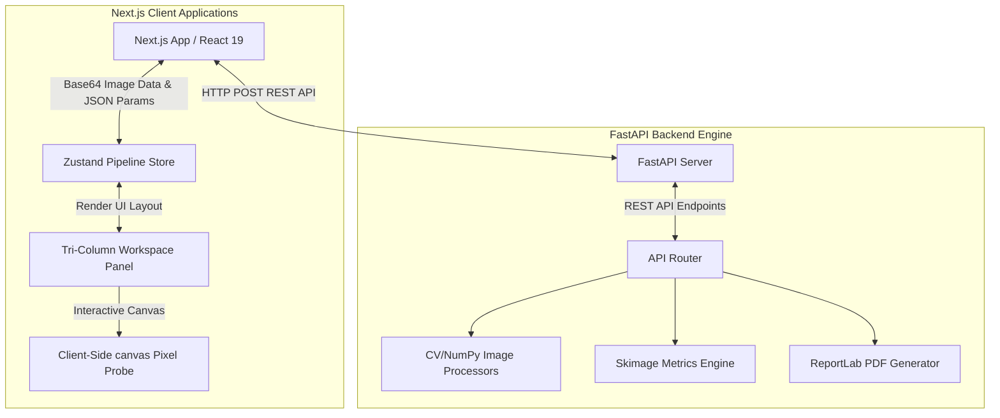
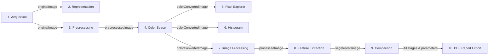

# 🔬 VisionLab: Computer Vision & Digital Image Processing Suite

[](https://nextjs.org/)
[](https://fastapi.tiangolo.com/)
[](https://opencv.org/)
[](#)

VisionLab is an interactive, academic playground and computer vision workstation designed to visualize, explore, and experiment with the mathematical foundations of Digital Image Processing (DIP). Unlike standard photo editors, VisionLab exposes the discrete grids, mathematical kernels, and frequency transformations that turn light arrays into semantic data.

---

## 🏗️ System Architecture

VisionLab is built using a decoupled Client-Server architecture. The frontend handles interactive visualizations, UI layout, canvas rendering, and real-time client-side pixel probes. The backend operates as a high-performance Python image processing server, executing heavy scientific computations using OpenCV, NumPy, and Scikit-Image.

### High-Level System Flow


### Tri-Column Workspace Concept
The application workspace follows a structured, three-column layout designed to resemble an academic lab station:
1. **Left Column (Navigation Sidebar):** A linear pipeline containing the 10 DIP chapters. Subsequent chapters are locked until an image is acquired.
2. **Center Column (Main Workbench):** Displays the interactive original vs. processed images, configuration parameters (sliders, dropdowns), and the core theoretical equations.
3. **Right Column (Real-time Diagnostic Panel):** Provides context-aware mathematical readouts, coordinate matrices, channel histograms, detected contour lists, or SSIM difference heatmaps.

---

## 🔄 The Linear DIP Pipeline & Data Flow

VisionLab implements a **linear, cumulative pipeline model**. Under this model, the output of one processing stage becomes the candidate input for the downstream stages. Adjusting sliders at an upstream stage (e.g., Preprocessing) triggers an automatic, reactive propagation down the chain, updating all active preview states.



---

## 🧪 Detailed DIP Chapters & Implementations

### 1. Image Acquisition
* **Concept:** Acquires raw light intensity data. Provides options to upload custom files, capture live video streams via browser camera, or select seeded reference grids (`test_pattern.png`, `coins.png`, `cameraman.png`, `color_chart.png`).
* **Implementation:** Estimates bytes and inspects MIME headers on upload. Passes the image to the backend `/api/acquire` endpoint to validate dimensions and extract format metadata.

### 2. Image Representation
* **Concept:** Demonstrates spatial and amplitude discretization (sampling and quantization).
* **Implementation:** 
  * *Spatial Sampling:* Resizes the image to a low resolution (controlled by sampling rate $N$) using nearest-neighbor interpolation (`cv2.INTER_NEAREST`), then scales it back up to create a blocky pixelated grid.
  * *Amplitude Quantization:* Reduces color bits from 8-bit ($256$ levels) down to $b$ bits ($2^b$ levels) using integer division mapping:
    $$\text{Quantized} = \left\lfloor \frac{\text{Intensity}}{256/2^b} \right\rfloor \times \frac{256}{2^b}$$
  * *Lattice Matrix:* Extracts a center $16\times16$ subgrid as a raw numerical intensity array to show on the diagnostic sidebar.

### 3. Preprocessing & Point Operators
* **Concept:** Prepares images for downstream feature extraction by modifying brightness, contrast, size, and noise profile.
* **Implementation:**
  * *Brightness & Contrast:* Applied via pixel scaling: $g(x,y) = \alpha \cdot f(x,y) + \beta$.
  * *Denoising:* Includes Gaussian filtering (using odd-sized kernels), Median filtering (for impulse/salt-and-pepper noise), and Bilateral filtering (preserves edges while smoothing flat areas).
  * *Contrast Stretching:* Standardizes lighting ranges using Min-Max Normalization:
    $$g(x,y) = \frac{f(x,y) - \min}{\max - \min} \times 255$$

### 4. Color Space Conversions
* **Concept:** Explores alternative coordinate systems representing luminance and chrominance.
* **Implementation:** Converts images using OpenCV color mappings:
  * Grayscale: Y = $0.299R + 0.587G + 0.114B$
  * Binary: Segmented at a target threshold value.
  * HSV (Hue, Saturation, Value): Disconnects chromaticity from intensity.
  * CIELAB ($L^*a^*b^*$): Model based on human color perception, decoupling lightness ($L$) from color opponent dimensions ($a$ and $b$).

### 5. Pixel Explorer
* **Concept:** Focuses on point inspections and the local neighborhood dependencies of convolution operations.
* **Implementation:** 
  * Uses client-side `<canvas>` elements to read RGB values on mouse coordinates in real-time.
  * Computes conversions to HSV and CIELAB dynamically.
  * Inspects a local $3\times3$, $5\times5$, or $7\times7$ spatial box around the cursor, displaying local grayscale values in a live coordinate grid.

### 6. Histogram Analysis
* **Concept:** Visualizes global color distributions and cumulative frequencies.
* **Implementation:**
  * Computes separate Red, Green, Blue, and Grayscale probability density functions (PDF) using `cv2.calcHist`.
  * Computes the Cumulative Distribution Function (CDF) using `np.cumsum` to show contrast distribution.
  * Implements *Histogram Equalization* to spread out dominant intensity values:
    * For Grayscale: Standard `cv2.equalizeHist`.
    * For Color: Converts to YCrCb space, equalizes the Y (Luminance) channel, and converts back to BGR to avoid chromatic distortion.

### 7. Image Processing Engine
* **Concept:** Spatial filtering, spatial gradients, thresholding, and morphology.
* **Implementation:**
  * *Filtering:* Box blur, Gaussian, Median, Bilateral, Laplacian, and *Custom Kernel* convolution (e.g. custom $3\times3$ sharpening or edge filters) utilizing `cv2.filter2D`.
  * *Thresholding:* Global Binary, Inverse Binary, Truncate, Tozero, Otsu's optimal binarization, and local adaptive thresholding (Mean or Gaussian).
  * *Edge Detection:* Sobel operators ($dx$ gradient, $dy$ gradient, and magnitude $\sqrt{g_x^2 + g_y^2}$), Laplacian of Gaussian, and Canny edge tracking.
  * *Morphology:* Dilation, Erosion, Opening, Closing, Morphological Gradient, Tophat, and Blackhat using Rectangular, Cross, or Elliptical structuring elements.

### 8. Feature Extraction & Segmentation
* **Concept:** Connected components, contours, and geometric descriptors.
* **Implementation:**
  * Extracts external contours using `cv2.findContours` and filters them based on user-defined area bounds.
  * Renders boundary lines and bounding boxes labeled with index IDs.
  * Calculates geometric stats for each detected object:
    * Centroid coordinates: $C_x = \frac{M_{10}}{M_{00}}, C_y = \frac{M_{01}}{M_{00}}$
    * Bounding box dimensions $[x, y, w, h]$.
    * Circularity coefficient:
      $$\mathcal{C} = \frac{4\pi \cdot \text{Area}}{\text{Perimeter}^2}$$

### 9. Result Comparison
* **Concept:** Quantitative and qualitative evaluation of processing outcomes.
* **Implementation:**
  * Implements a sliding divider component to compare original vs. processed images.
  * Computes standard metrics: Mean Squared Error (MSE), Peak Signal-to-Noise Ratio (PSNR), and count of changed pixels.
  * Computes the structural similarity index (SSIM) map using `skimage.metrics.structural_similarity`.
  * Renders qualitative error heatmaps by applying `cv2.applyColorMap` (using JET or HOT colormaps) on absolute difference/SSIM maps.

### 10. PDF Report Export
* **Concept:** Documents workspace parameters and outputs.
* **Implementation:** Encodes all parameter stores, metadata, and generated image state matrices to call `/api/export/report`. The backend generates a publication-ready PDF using ReportLab with multi-column tables, aspect-ratio-scaled images, and system configurations.

---

## 📂 Repository Directory Structure

```
VisionLab/
├── backend/                  # FastAPI Python Backend
│   ├── api/
│   │   └── routers.py        # API router definitions and routing logic
│   ├── models/
│   │   └── schemas.py        # Pydantic request models
│   ├── processing/           # Core image processing computations
│   │   ├── analysis.py       # Metrics, SSIM, and error heatmaps
│   │   ├── colorspace.py     # Color space conversions
│   │   ├── filters.py        # Filtering, thresholding, edges, morphology
│   │   ├── histogram.py      # Histograms and equalization
│   │   ├── preprocessing.py  # Resize, noise, brightness/contrast, stretch
│   │   ├── representation.py # Downsampling and quantization
│   │   └── segmentation.py   # Contour extraction and measurements
│   ├── reports/
│   │   └── pdf_generator.py  # ReportLab PDF compilation
│   ├── utils/
│   │   ├── cv_helpers.py     # Base64-to-OpenCV numpy utility converters
│   │   └── seed_images.py    # Seed generator for test images
│   ├── requirements.txt      # Python backend packages
│   └── main.py               # Backend main entrypoint (Uvicorn launcher)
│
├── src/                      # Next.js TypeScript Frontend
│   ├── app/                  # Next.js App Router
│   │   ├── workspace/
│   │   │   └── page.tsx      # Main layout workspace page
│   │   ├── globals.css       # CSS entrypoint with Tailwind v4 definitions
│   │   ├── layout.tsx        # Top-level HTML template structure
│   │   └── page.tsx          # Educational landing page
│   ├── components/
│   │   └── layouts/          # Reusable shell layout components (Tri-Column)
│   │       ├── Footer.tsx
│   │       ├── ModuleWorkspace.tsx
│   │       ├── Navbar.tsx
│   │       └── Sidebar.tsx
│   ├── modules/              # Sub-modules matching the DIP chapters
│   │   ├── Acquisition/
│   │   ├── ColorConversion/
│   │   ├── Comparison/
│   │   ├── Export/
│   │   ├── Histogram/
│   │   ├── ImageProcessing/
│   │   ├── PixelAnalysis/
│   │   ├── Preprocessing/
│   │   ├── Representation/
│   │   └── Segmentation/
│   ├── services/
│   │   └── api.ts            # Client-side fetch wrapper mapping endpoints
│   ├── store/
│   │   └── usePipelineStore.ts # Zustand global state manager
│   └── types/
│       └── index.ts          # Unified TS interface models
│
├── public/                   # Static assets
│   └── images/               # Seeded reference images
├── package.json              # NPM dependencies & scripts
└── tsconfig.json             # TypeScript options configuration
```

---

## 🚀 Getting Started

Follow these steps to run VisionLab locally on your system.

### Prerequisites
- Node.js (v18 or higher)
- Python (v3.9 or higher)

### 1. Start the FastAPI Backend

1. Navigate to the backend directory:
   ```bash
   cd backend
   ```
2. Create and activate a Python virtual environment:
   ```bash
   python3 -m venv .venv
   source .venv/bin/activate
   ```
3. Install the required dependencies:
   ```bash
   pip install -r requirements.txt
   ```
4. Seed the reference images to the public directory:
   ```bash
   python utils/seed_images.py
   ```
5. Launch the backend server:
   ```bash
   python main.py
   ```
   The backend server will run on `http://localhost:8000`. You can inspect the API endpoints docs at `http://localhost:8000/docs`.

### 2. Start the Next.js Frontend

1. Open a new terminal window in the project root directory.
2. Install the frontend dependencies:
   ```bash
   npm install
   ```
3. Run the development server:
   ```bash
   npm run dev
   ```
4. Open your browser and navigate to `http://localhost:3000`.

---

## 🎓 Academic Curriculum Context

VisionLab is structured to map directly to topics covered in classic computer vision textbooks like *Gonzales & Woods - Digital Image Processing*:
- **Ch 1-2:** Analog-to-digital signal digitization.
- **Ch 3:** Spatial domain point transformations and spatial filters.
- **Ch 4:** Multi-channel color systems and representations.
- **Ch 6:** Dynamic histogram processing and CDF mapping.
- **Ch 9-10:** Edge operators, image segmentation, and object measurements.

Use this environment to experiment with sliders and watch raw matrices change state in real-time, bridging the gap between theoretical equations and visual output!
